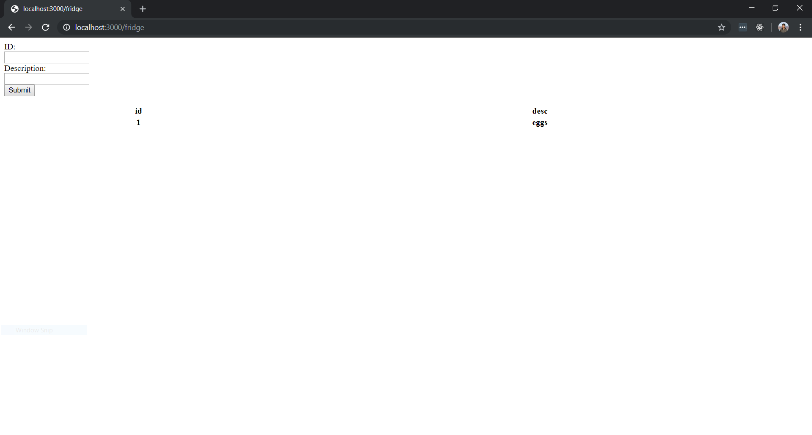
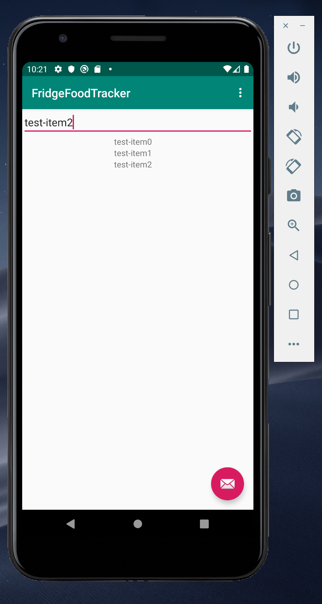

# 2019-group-fridgefoodtracker

<h2>HOW TO START OUR APPLICATION</h2>

1) Start the server manually
- We haven't yet deployed a server yet, so you have to start it locally. The developers plan to have their own server deployed by the end of Iteration 4.

~~~
cd server
npm start
~~~

- On Google Chrome, go to localhost:3000/fridge/
  - You should see the below page. By using the input fields in the top left, submitting, and refreshing the page, you should be able to see what items are currently in your fridge.

2) Open the app
- Open our project in Android Studio
- Run our MainActivity on an emulator
  - We are using a Pixel 3a API 29
- You should see the following screen:

- Enter a food item name in the input field at the top, and submit using the floating action button in the bottom right
  - The floating action button might be hidden behind the keyboard
- What you see on your emulator screen should match what you see in your web browser from step (1).
  - You will need to refresh your web browser to see the updated database in browser.

Troubleshooting
- Server doesn't start
  - Install npm with 
  ~~~
  npm install
  ~~~
  
- I don't have an emulator
  - Go to emulator -> Open AVD Manager -> Create Virtual Device
  - Select Pixel 3a -> Next
  - Select 'Q' as system image (API Level 29) -> Next -> Finish
  
- My configuration isn't working
  - Create an Android app with Module 'app'

<h2>ITERATION 2</h2>

We've implemented manual data entry as our first feature.

We have unit tests written for Fridge, ItemList, and Item, and we have functional tests in Postman for our server.

We have begun implementation of barcode-reading, and our progress can be seen in BarcodeScanner project. We will integrate the scanner in iteration 3. 

<h2>ITERATION 3</h2>

We've begun the modification of tableview for Fridge, showing the item as well as a button for deletion. We plan to have the button to get more info about the food item, as well as add some sort of progress bar showing the freshness of the item.

We've merged OCR functionality with the main app.

We've remodeled our item class to work better with our server.

