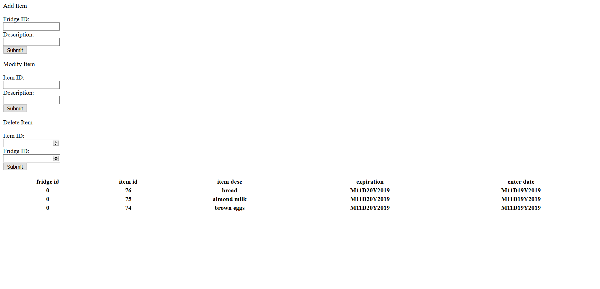
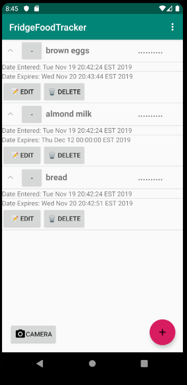
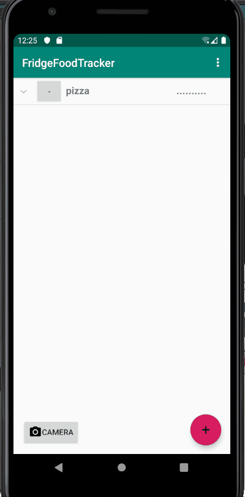
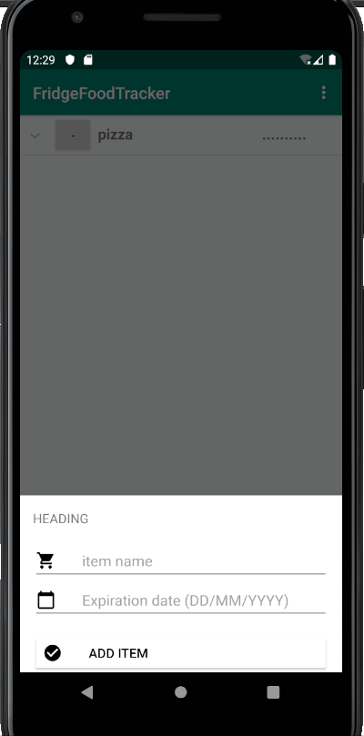
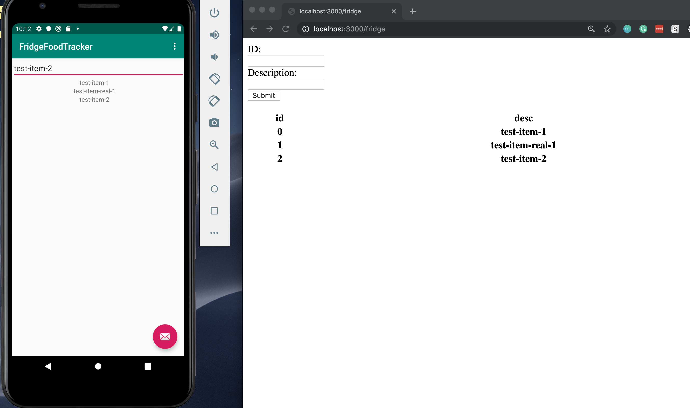
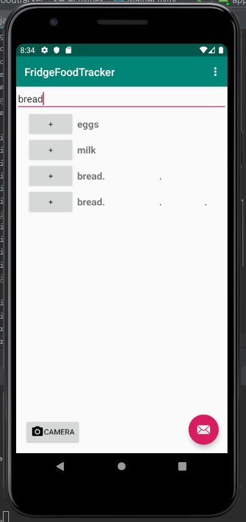

# 2019-group-fridgefoodtracker

<h2>HOW TO START OUR APPLICATION</h2>

<h2>1) Use our deployed server</h2>

https://oose-fridgetracker.herokuapp.com/fridge

Or if you don't want to use our server, start it yourself.

To start the server manually go to /src/server and type the following commands:
```
npm init
npm start
```

- On Google Chrome, go to localhost:3000/fridge/ if you are running the server manually or https://oose-fridgetracker.herokuapp.com/fridge
  - You should see the below page. By using the input fields in the top left, submitting, and refreshing the page, you should be able to see what items are currently in your fridge. 



<h2>2) Open the app</h2>

- Open our project in Android Studio
- Run our MainActivity on an emulator
  - We are using a Pixel 3a API 29


<h2>3) Using the app </h2>

<h4>Overview</h4>


- Press the floating action button in the bottom right to open the Items Entry fragment
  - The floating action button might be hidden behind the keyboard
- What you see on your emulator should match what you see on our Heroku server.
  - You will need to refresh your web browser to see the updated database in browser.
  
  
<h4>Adding Items</h4>





- We have a Date Picker to make it easy for you to input an expiration date
- Expiration date defaults to tomorrow if you don't put one in


<h4>Deleting Items</h4>


- Delete items by first expanding them, and then hitting delete


<h4>Editing Items</h4>


- Put in a new name and a new expiration date
- TODO: put the Date Picker here as well


<h4>Sorting Items</h4>


- Options in the top right corner
- TODO: set a sorting flag so that adding new items keeps stays in sorting order


<h4>To Be Implemented in Interation 6</h4>

- Set up the Date Picker for Editing Items
- Maintain sorted order when Adding Items


<h2>Troubleshooting</h2>

- Server doesn't start
  - Install npm with 
  ~~~
  npm install
  ~~~
  
- I don't have an emulator
  - Go to emulator -> Open AVD Manager -> Create Virtual Device
  - Select Pixel 3a -> Next
  - Select 'Q' as system image (API Level 29) -> Next -> Finish
  
- My configuration isn't working
  - Create an Android app with Module 'app'


<h2>ITERATION 2</h2>



We've implemented manual data entry as our first feature.

We have unit tests written for Fridge, ItemList, and Item, and we have functional tests in Postman for our server.

We have begun implementation of barcode-reading, and our progress can be seen in BarcodeScanner project. We will integrate the scanner in iteration 3. 

<h2>ITERATION 3</h2>

We've begun the modification of tableview for Fridge, showing the item as well as a button for deletion. We plan to have the button to get more info about the food item, as well as add some sort of progress bar showing the freshness of the item.

We've merged OCR functionality with the main app.

We've remodeled our item class to work better with our server.



Due to how Heroku works, the majority of the server work has been splintered off to the server_deployed branch as Heroku needs the deployed application to be at the highest directory level of the project. You will find the latest server code and commits on the server on that branch.


