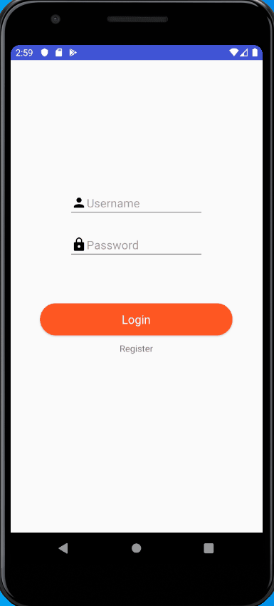

# 2019-group-fridgefoodtracker

<h2>HOW TO START OUR APPLICATION</h2>

<h2>1) Use our deployed server</h2>

https://oose-fridgetracker.herokuapp.com/fridge

Or if you don't want to use our server, start it yourself.

To start the server manually go to /src/server and type the following commands:
```
npm init
npm start
```

- On Google Chrome, go to localhost:3000/fridge/ if you are running the server manually or https://oose-fridgetracker.herokuapp.com/fridge
  - You should see the below page. By using the input fields in the top left, submitting, and refreshing the page, you should be able to see what items are currently in your fridge. 


<h2>2) Open the app</h2>

- Open our project in Android Studio
- Run our MainActivity on an emulator
  - We are using a Pixel 3a API 29


<h2>3) Using the app </h2>

<h4>Register and Login New User</h4> 


<h4>Login Existing User</h4>



<h4>Create Fridge</h4>  


<h4>Manual Add Items</h4>


- We have a Date Picker to make it easy for you to input an expiration date
- Expiration date defaults to tomorrow if you don't put one in

<h4>Use Camera to Add Items</h4>

<h4>Eating Items</h4>


- Eat items by first expanding them, and then hitting eat
- Eaten items will be stored for recommendation data

<h4>Trashing Items</h4>


- Eat items by first expanding them, and then hitting trash

<h4>Editing Items</h4>


- Put in a new name and a new expiration date


<h4>Sorting Items</h4>


- Options in the top right corner

<h4>Switching Fridges</h4>


<h4>Displaying Recommendations</h4>

<h4>Displaying Notifications</h4>


<h4>Logout</h4>


<h2>Troubleshooting</h2>

- Server doesn't start
  - Install npm with 
  ~~~
  npm install
  ~~~
  
- I don't have an emulator
  - Go to emulator -> Open AVD Manager -> Create Virtual Device
  - Select Pixel 3a -> Next
  - Select 'Q' as system image (API Level 29) -> Next -> Finish
  
- My configuration isn't working
  - Create an Android app with Module 'app'


