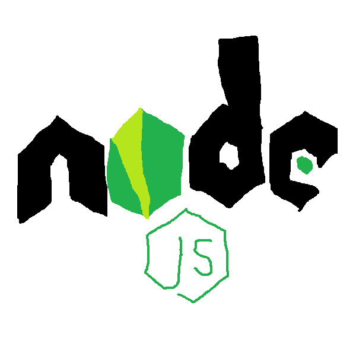
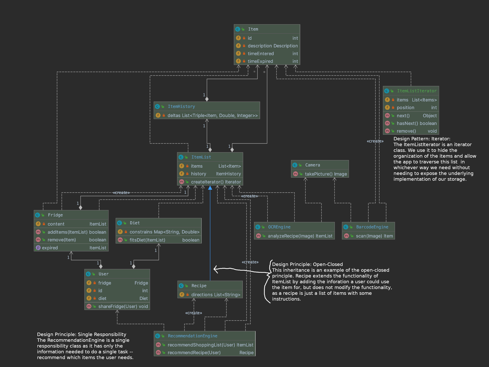

# Design

# Architecture

<!-- Is this a web application, 
a mobile application (React Native, iOS, Android?), 
a desktop application, and so forth? 
How do the different components (client, server, and so forth) communicate? 
Don’t simply list tools; tell a story. -->
* Mobile App - Android Studio, Java SDK 12 

Our application is an Android application with Java 12.  

* OCR API - receipt camera

It would be convenient for users to have multiples ways to input items to the app. Therefore, we
're using OCR to extract items from receipts. More specifically, we included Google Firebase
 Vision ML SDK to our application so that we can use [text recognition APIs] (https://firebase.google.com/docs/ml-kit/android/recognize-text). 
  
* jcomo/Shelf Life API - expiration dates
 
 To obtain common food expiration dates, we use 
 [Shelf Life API] (https://github.com/jcomo/shelf-life/tree/master/src/main/java/me/jcomo/stilltasty) developed by jcomo.

* openFDA - give notifications about food recalls and overall food safety alerts
One feature to add further down the line is to be able to alert users of food that the FDA has put alerts out on so that users will be notified about what food to avoid in their current fridge and what food to avoid shopping for in their next grocery trip. Here is the [API](https://open.fda.gov/)

* Web Server - Node backend with RESTful API

For the server side, we are going to build a Node.js RESTful API.

* Frontend 
We make XML through Layout Editor in Android Studio because it's built-in and simple. 
## Tools Outside the Toolbox

<!-- For each tool: What is it? Why did you choose it? 
Where do you get it?
 How do you learn it? 
 Follow the model of how we presented the tools in the Toolbox. 
 Cute original drawings encouraged. -->
 We mentioned these tools above in the Architecture section. Here's a summary of them:
 
#### Android Studio 

 * What is it? 
 Android Studio is the official integrated development environment for Google's Android operating
  system.
 * Why did we choose it?
 Android studio is the official IDE for android app development and we'd like to use the standard.
 * Where did we get it?
 Android studio is available [here] (https://developer.android.com/studio).
 * How do we learn it?
 It can be learned through multiple tutorials online or by just reading through the official API documentation.
#### ML Kit
  * What is it? 
  ML Kit is Google's machine learning library optimized for mobile development.
  * Why did we choose it? 
  We chose this library due to the open source library for both text recognition and barcode recognition which we will use in order to input items into our fridge.
  * Where did we get it? 
  The tutorial for integrating ML Kit can be found .
  * How do we learn it? 
  The open source documentation is availble online as well as simple tutorials provided by Google. 

#### jcomo/Shelf Life API
   * What is it? 
   An API to get information about the shelf life of food and tips about how to keep food fresh. The data provided comes from [Still Tasty](https://www.stilltasty.com/)
   * Why did we choose it? 
   Free open source library to allow us to get shelf life data without manually inputting the data into our own database.
   * Where did we get it? 
   The API can be found [here](https://github.com/jcomo/shelf-life)
   * How do we learn it? 
   Learning the API can be done through reading through the documentation at the given link.

#### openFDA API
   * What is it?
   Provides raw download and access to a number of of high-value, high priority and scalable structured datasets, including adverse events, drug product labeling, and recall enforcement reports.
   * Why did we choose it?
   Free open source library to be used for official data about recall enforcement reports for a notificication feature that will be integrated into the app about when users should throw out and avoid certain items.
   * Where did we get it?
   The full database can be found [here](https://open.fda.gov/) and the [food enforcement API] (https://open.fda.gov/apis/food/enforcement/) is available.
   * How do we learn it?
   Like above, using the API will be learned through reading the corresponding documentation.

#### Node.js 

 * What is it? 
 Node.js is an open-source, cross-platform, JavaScript run-time environment that executes JavaScript code outside of a browser.
 * Why did we choose it? 
 Node.js is the standard for enterprise level organizations, and it is lightweight and scalable which perfectly suits are needs for out back end database.
 * Where ddid we get it? 
 Node.js can be download [here](https://nodejs.org/en/download/)
 * How do we learn it?    
 Node.js can be learned using these [official guides](https://nodejs.org/en/docs/guides/)

We attached the tool links to the items and that's where we can look up for documentations. We
 can learn them from the official tutorials published on these websites. 

# Class Diagram

Design patterns that we used are explained in the class diagram. 
